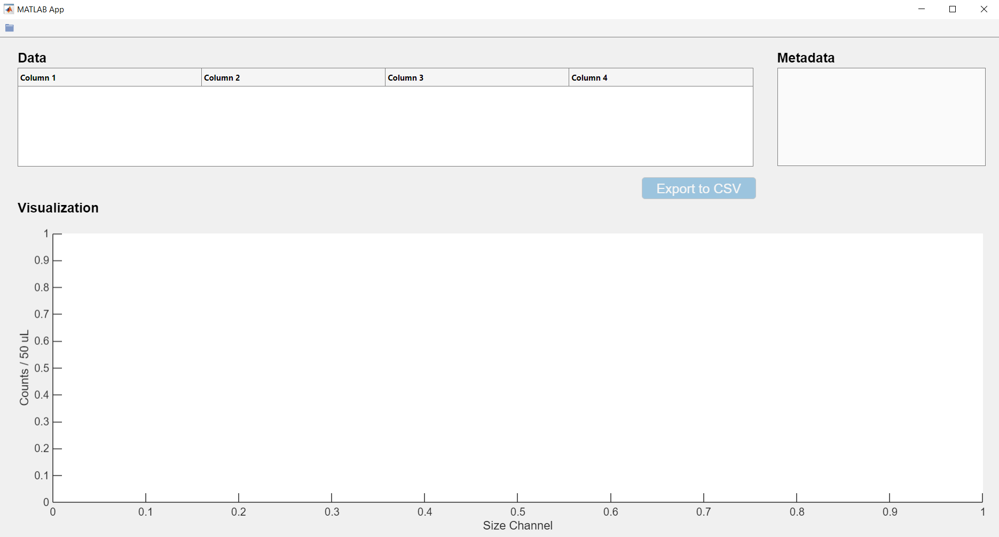
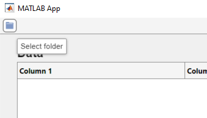
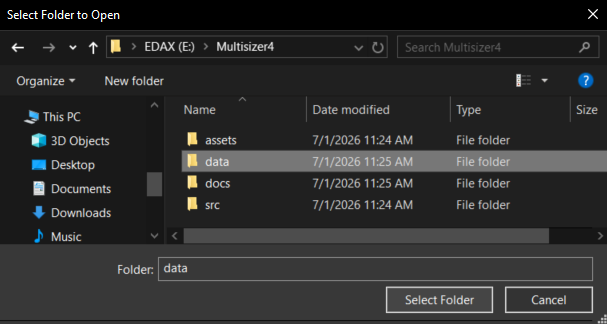
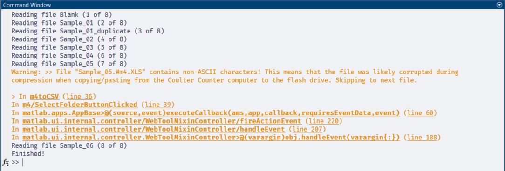
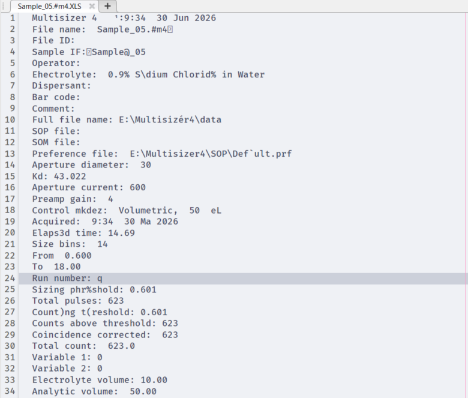
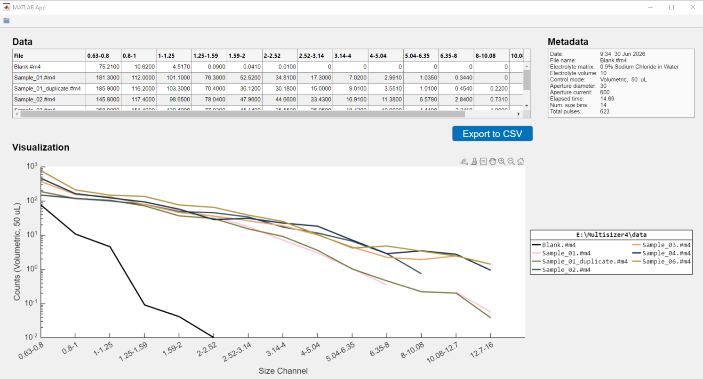

# Documentation
### Use the `m4` app to extract data from Beckman Multisizer 4 files.

Copyright (C) 2026 Austin M. Weber

# Installation
Installing the `m4` app should be as simple as clicking the <kbd>Add-Ons</kbd> button on the Home tab of your MATLAB Desktop, then navigating to the repository in the Add-On Explorer and then clicking the <kbd>Add</kbd> button on the repository page.

**Alternatively:**

1. To install the app, first download the [GitHub repository](https://github.com/weber1158/m4-app) onto your PC, and then unzip its contents in the location where you want the files stored.

2. Install the repository on your MATLAB path by executing the `pathtool` command in the Command Window. This will open the Set Path dialog box. From here, click <kbd>Add with Subfolders...</kbd> and navigate to where you unzipped the repository files. Select the main folder, and automatically all of the sub-folders should be addeded to the default search path. Remember to hit <kbd>Save</kbd> or <kbd>Apply</kbd> before closing the Set Path dialog box!

# The Graphical User Interface (GUI)
Open the GUI by executing the `m4` command in the Command Window. The v1.0 interface looks like this:

Click the blue folder icon in the upper left corner to open the Select Folder dialog box:

Navigate to the folder that contains your Multisizer 4 files, select the folder, and then click the <kbd>Select Folder</kbd> button.
- Note: The folder that you select should contain files ending in a `.#m4.xls` file extension.

Once you select a folder, the app will begin parsing through the relevant `.#m4.xls` files. Print statements will appear in the Command Window as the app runs through each file, which will help you diagnose issues should things go wrong. 

To illustrate, one of the files in the example `data` folder contains corrupted data. In situatoins where a `.#m4.xls` file contains non-ASCII characters, a warning message will identify the problematic file before skipping the file and moving on to the next file. An example of the Command Window print statements is shown below:

Notice that when parsing the 7th data file (`Sample_05.#m4.XLS`) the app identified non-ASCII characters in the file. If we take a look inside this file (which you can do by right-clicking the file in MATLAB and selecting <kbd>Open as Text</kbd>) you can see the issue:

The non-ASCII characters in the file trigger the warning message. In this case, the presence of these non-ASCII characters is due to a compression issue that occurred when I copy-pasted the original `.#m4.XLS` file from the Multisizer 4 computer onto a flash drive. This can happen if you copy-paste many files at once, and so I have designed the app to alert the user of which files are corrupted so that you don't have to go through each of the files individually to find which files (if any) need to be re-copied.

Returning to the GUI, the app interface will update upon selecting an appropriate folder. In the case of the example `data` folder, the GUI should look like this:

The simplistic design of the interface makes it very easy to interpret your data. The **Data** table at the top contains a MATLAB table object that lists the names of each file with columns corresponding to the number of counts in each size channel. You can save this data as a CSV file by clicking the <kbd>Export to CSV</kbd> button.

The **Metadata** text area in the top right shows the instrument conditions for the first file in the folder, which in this case is the metadata for the blank. The reported metadata includes the original date of collection, the electrolyte matrix, the aperture diameter, and more useful information.

The **Visualization** panel at the bottom of the GUI compares the data from all samples on a log-scale Y-Axis. Note that the y-axis will be labeled according to the units of your Multisizer data, and the x-axis ticks will be labeled according to the relevant size channels. 

A legend is included on the right of the chart using scientific colors (Crameri et al., 2020, *Nature Communications*) that theoretically should be colorblind friendly and perceptually distinct. Notice that the blank (the black line) contains significantly fewer particles than the samples, as expected. 